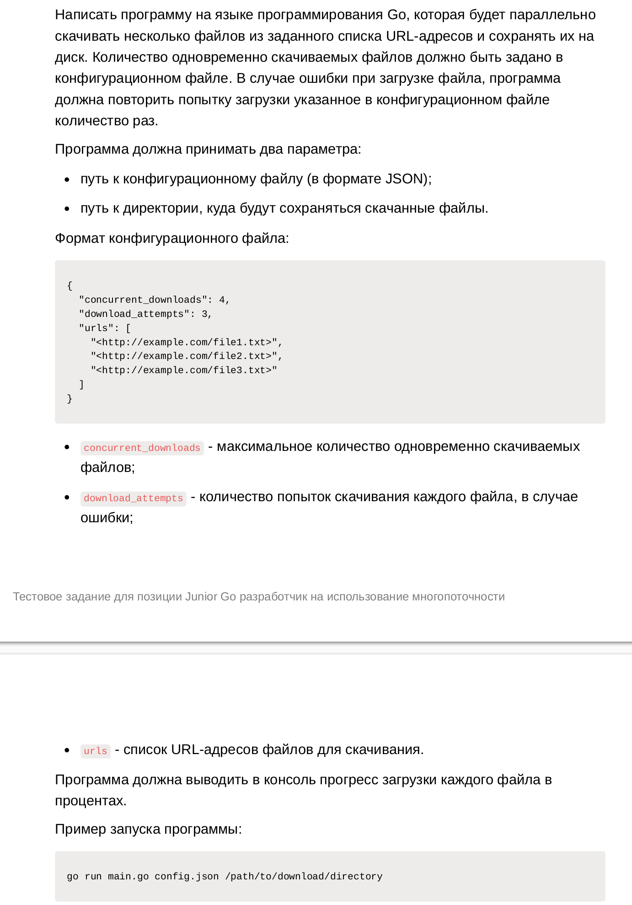

# First Bit / test_assignment №2

Read from STDIN + parse config.json → Write to STDOUT + downloading files in select directory

## Description


## Example Start

```bash
go run main.go config.json /path/to/download/directory
```